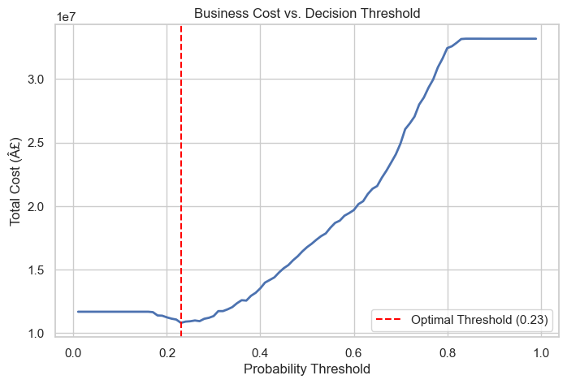
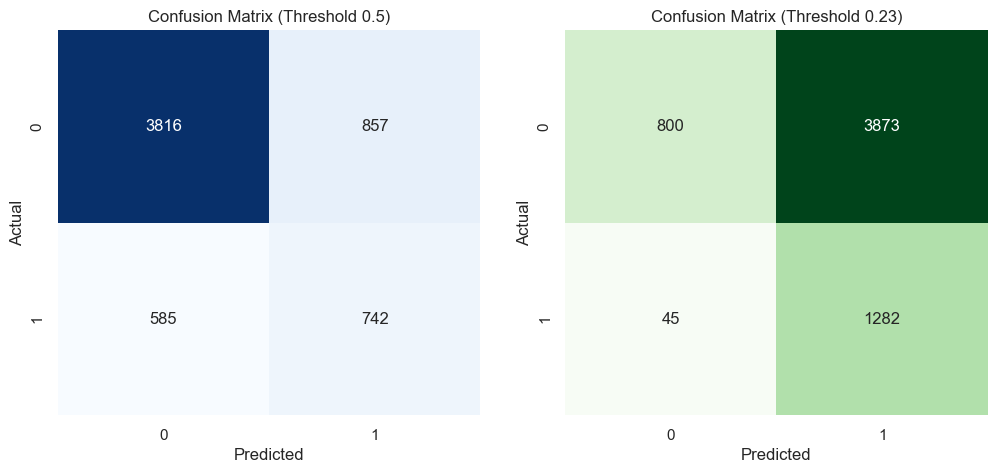
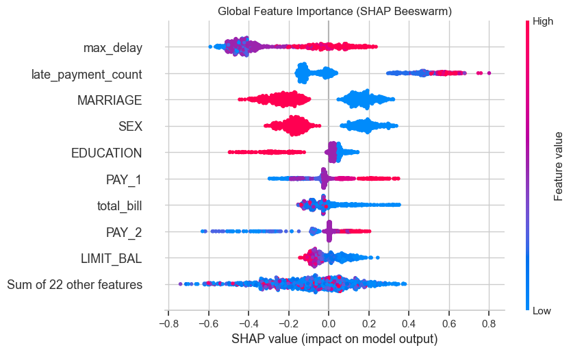

# Executive Summary: Credit Risk ML Model

## 1. The Business Challenge
Traditional models optimise for accuracy and apply a 0.5 decision threshold, assuming all errors are equally costly. In credit risk, that assumption is wrong by an order of magnitude. Missing a default costs £25,000 (principal loss + collections), while wrongly rejecting a good customer costs £2,500 (lost interest). This 10:1 cost ratio requires a specialised, cost-sensitive approach.

## 2. Business Result & Financial Impact
By replacing the naive 0.5 probability threshold with a mathematically derived optimal threshold of **0.23**, the XGBoost model transformed abstract ML accuracy into a quantifiable financial outcome.

**Impact on the 6,000-customer test portfolio:**
- **Defaults caught:** Increased from 741 to 1,281 (+540 additional defaults).
- **Detection rate:** Improved by 72.8%.
- **Net financial saving:** £5,960,000 compared to the baseline.

*Note: The £5.96M figure accounts for every false positive incurred at the lower threshold — the saving is real net of intervention cost.*

## 3. Performance & Threshold Analysis

By simulating the financial costs across different probability thresholds, we computationally derived the optimal decision threshold (0.23). The cost curve below illustrates how total business cost is minimized at this point.

Below is a comparison of the confusion matrices between the default 0.5 threshold and our optimized 0.23 threshold, showing the trade-off of catching more defaults vs. flagging more false positives.

## 4. Explainability and Risk Factors
The model utilizes SHAP (SHapley Additive exPlanations) to provide full transparency. The beeswarm plot below shows the most critical risk drivers across the entire portfolio. Payment delays (`PAY_1`), low limit balances (`LIMIT_BAL`), and high utilization rates are the strongest indicators of default.

## 5. Conclusion & Recommendations
The cost-sensitive model successfully bridges the gap between technical metrics and business ROI. We recommend deploying this model in a shadow-testing environment to validate the projected £5.96M savings per 6,000 applicants, while actively monitoring the top SHAP features for macroeconomic drift.
